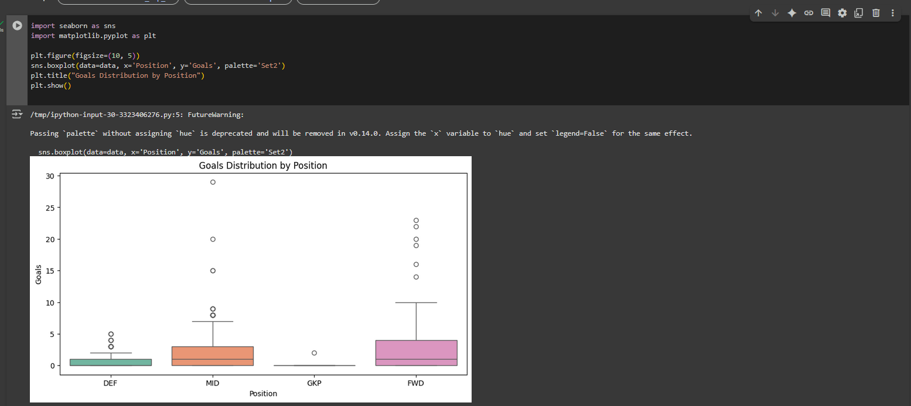

# ⚽ EPL 2024/2025: Predicting Top Scoring Players using Machine Learning

This project aims to predict the number of goals a player is likely to score in the 2024/2025 English Premier League (EPL) season using regression techniques.

## 📌 Objective

To build a regression model that predicts player goal counts based on key performance indicators such as:
- Shots and shots on target
- Assists and minutes played
- Progressive carries and passes
- Conversion rates and touches

## 📊 Dataset Overview

The dataset contains EPL player statistics for the 2024/2025 season with the following key columns:
- Player Name, Club, Nationality, Position
- Appearances, Minutes, Goals (target)
- Shots, Assists, Passes, Carries, Crosses, etc.

## 🔍 Steps Covered

1. Data Cleaning & Exploration
2. Feature Selection & Engineering
3. Regression Modeling (Linear Regression, Random Forest, XGBoost)
4. Model Evaluation (MAE, RMSE, R²)
5. Insight Extraction & Visualization
6. (Optional) Model Deployment or Dashboard

## 🔧 Tools & Libraries Used

- Python (Pandas, NumPy, Scikit-Learn, Matplotlib, Seaborn)
- Jupyter Notebook
- Git & GitHub

## 📈 Expected Outcome

- Understand key features that impact goal scoring

- ## 2. PROBLEM DRIVEN STRUCTURE

### 1.What kind of players score the most goals?

- **Forwards (FWD)** clearly have the highest number of goals on average. Their box is higher and more spread out, indicating more consistent goal scoring.
- **Midfielders (MID)** come second. Some midfielders have surprisingly high goal tallies, suggesting roles like attacking midfielders or wingers.
- **Defenders (DEF)** rarely score, but a few outliers (likely from set-pieces) exist.
- **Goalkeepers (GK)** almost never score, as expected — they mostly stay at 0 goals.

### **2. Do players who play more minutes score more goals?**

Is there a direct relationship between the amount of time a player spends on the pitch and their goal tally?

- There is a **positive trend**: as minutes increase, so do goals — especially for forwards.
- Many **low-minute players have zero goals**, as expected.
- A few players score **many goals in fewer minutes**, hinting at **super-subs** or **highly efficient attackers**.
- Midfielders show a more scattered pattern — some contribute well with fewer minutes, likely due to their playmaking roles.

### **3. What stats are most correlated with goals?**

- `Shots` has the **strongest positive correlation** with `Goals` — players who shoot more tend to score more.
- `Shots On Target` also shows a **high correlation**, which makes sense — accuracy matters.
- `Conversion %` is moderately correlated, showing that **efficiency adds value**, even with fewer attempts.
- `Minutes` is positively related, but not as strong — time helps, but doesn’t guarantee goals.
- `Assists` has a **weaker correlation** with goals — this makes sense as it's more related to the passer than the scorer.

### **4. Which features influence the model the most?**

- `Shots` is the **most important feature** — more shots = more chances to score.
- `Minutes` also ranks high — players need time on the pitch to convert.
- `Shots On Target`, `Conversion %`, and `Carries Ended with Goal` all show high importance, indicating **efficiency and movement matter**.
- Defensive stats like `Clearances` or `Aerial Duels` had very low influence — as expected.

### **5. How well does our model predict goals?**

- Most of the predictions fall **close to the red dashed line**, which represents perfect predictions.
- The model performs well on **average goal scorers**, but **slightly underpredicts extreme scorers** (like Haaland or Salah).
- There are a few outliers — players whose actual goals are much higher or lower than predicted.
- Predict goals with reasonable accuracy
- Deliver insights that can help analysts, clubs, and fantasy league enthusiasts

## 🙌 Author

Bryan Waweru – Aspiring Data Scientist | Football Fan | ML Explorer  
🔗 [LinkedIn] | 📫 [Email] (insert links)

---

Feel free to clone, fork, or contribute to this project.
